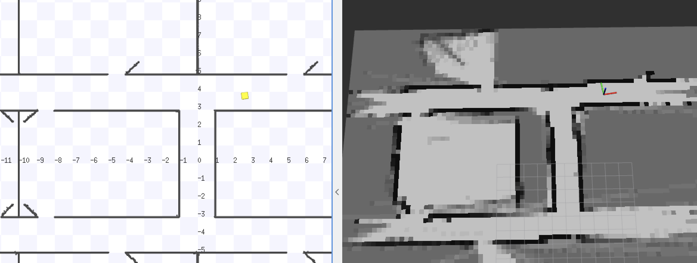
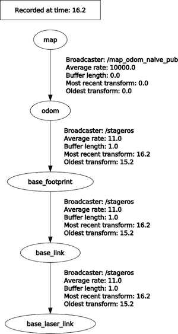
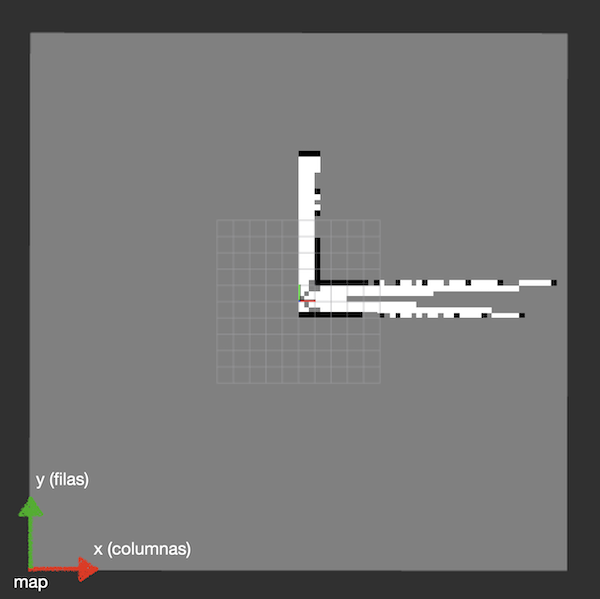

# Robots Móviles curso 2023-24
# Práctica 1: Mapeado *naive*

## 1. Introducción. Objetivos

En esta práctica implementaremos un algoritmo sencillo de construcción de mapas para robots móviles usando ROS. El objetivo de la práctica es, por un lado recordar conceptos básicos de programación en ROS, y por otro hacer una aproximación inicial a un **problema básico en robótica móvil: el mapeado de un entorno desconocido**. 

A falta de un término mejor al algoritmo propuesto lo hemos llamado mapeado *naive* o "ingenuo" porque nuestro algoritmo hará una simplificación poco realista: *suponer que en todo momento conocemos con precisión la posición actual del robot*.

Como veremos posteriormente en la asignatura con más detalle, en la realidad casi nunca va a ser así. Típicamente los robots móviles usan una técnica llamada **odometría** para calcular la posición actual. Dicha técnica genera errores que se van acumulando con el tiempo, de modo que la diferencia entre la posición real y la supuesta del robot va a ir aumentando gradualmente. Esto da lugar a mapas como el que se muestra en la figura 1. A la izquierda aparece el mundo simulado y a la derecha el mapa que construye nuestro algoritmo.



Posteriormente, en el tema de SLAM (Mapeado y Localización Simultáneos) veremos cómo solucionar este problema.

> El mapa que aparece en la figura anterior es una *rejilla de ocupación*. Está "pixelado" porque esta rejilla es una matriz 2D en la que cada celda representa un "cuadrado" de unas determinadas dimensiones en el mundo real (en la figura, cada celda representa 30x30cm). Cada celda tiene un valor numérico que indica la certidumbre que tenemos de que en esa posición en el mundo real haya un obstáculo. En la figura, cuanto más alto es el valor más oscuro aparece el tono de gris. Lo veremos luego con más detalle.

El resto del documento es como sigue: en primer lugar veremos cómo usar los ficheros que os dejamos como punto de partida para la práctica. Luego cómo implementar los requisitos mínimos de la práctica: el algoritmo básico, cómo transformar coordenadas entre sistemas y cómo trabajar con mapas en ROS. Después veremos funcionalidades que podéis añadir para obtener más nota y finalmente el baremo de evaluación y plazos de entrega.


## 2. Plantilla de ejemplo

Os dejamos un mundo simulado y un fichero de configuración de `rviz` para que podáis probar vuestro algoritmo.

Por simplicidad el simulador usado es *stage*, que no es ni siquiera 3D, ni implementa físicas realistas, pero consume pocos recursos computacionales, es fácil crear y configurar mundos simulados en él y tampoco necesitamos más "realismo" para este tipo de algoritmo. 

Primero deberíais crear un *workspace* de ROS salvo que queráis reutilizar uno ya hecho:

```bash
mkdir rob_mov_ws
cd rob_mov_ws
mkdir src
```

A continuación descargamos y compilamos los ficheros de ejemplo:

```bash
#hay que hacerlo en la carpeta  "src" del workspace
cd src
git clone https://github.com/ottocol/mapeado_naive
catkin_make
cd ..
#para actualizar las variables de entorno y que encuentre el paquete
source devel/setup.bash
```

Para probar el simulador, lanzar:

```bash
roslaunch mapeado_naive mapeado_naive.launch
```

Se abrirán dos ventanas: una con el simulador *stage* y otra con rviz. En *stage* el robot viene representado por el cuadrado amarillo. Si seleccionas la opción de menú de `View > Data` podrás ver el campo de visión del laser. En la ventana de `rviz` verás un *warning* relativo al mapa ya que todavía no hay ningún programa que lo esté publicando (¡es el que debes implementar!).

El *.launch* también pone en marcha un proceso de *teleop* que permite mover al robot con el teclado. Las teclas de control se mostrarán en la terminal. Recuerda que la ventana del *teleop* debe tener el foco de teclado para que la teleoperación funcione.

## 3. Requisitos mínimos de la práctica

El algoritmo de mapeado es muy simple y se puede formular con el siguiente pseudocódigo:

```python
#este código debería estar en el callback que reciba los mensajes del laser
#obtener la transformación que relaciona el sist de coordenadas del laser con el global
# Explicado en apartado 3.1 del enunciado
trans = obtener_transformacion_del_laser_al_sist_global()
Para cada distancia d detectada por laser:
    #convertimos la lectura del laser (distancia, ángulo) a coordenadas locales al robot 
    # Explicado al comienzo del apartado 3.3
	(x_l, y_l) = lectura_a_coord_locales(d, alfa)
	#convertimos las coordenadas locales a globales
	#usando la transformación obtenida antes
	# Explicado en apartado 3.1 
	(x_g,y_g) = coord_local_a_global(trans, x_l, y_l)
	#calculamos la celda del mapa correspondiente a las coordenadas
	# Explicado en apartado 3.2 
	(x_c, y_c) = coords_a_celdas_mapa(x_g,y_g)
	#actualizar la celda aumentando su valor de ocupación
	# Explicado en apartado 3.2 
	incrementar_celda(mapa, x_c, y_c) 
#publicamos el mapa como un topic de ROS, típicamente /map
publicar_mapa(mapa)
```

> Nota: evidemente los nombres de las funciones y los parámetros de las mismas pueden variar bastante en el código real, aunque la estructura del código sea la misma. Podéis hacer la implementación en Python o C++ pero todos los ejemplos que vamos a poner son en Python por sencillez de uso.

En esta versión básica del algoritmo solo incrementamos el valor de la celda correspondiente a la lectura detectada por el laser, con lo que en el mapa solo aparecerán los obstáculos pero no el espacio libre al contrario que en el mapa de la figura 1. También podríamos *decrementar* el valor de las celdas en la trayectoria del laser hasta esta celda. Si implementáis esto último tendréis una puntuación adicional, como se detalla luego.

El código fuente debe tener comentarios indicando qué es cada variable (excepto contadores y similares), qué hace cada función/método o en su caso cada clase que defináis. También indicad lo mejor que podáis lo que va haciendo el código.

Fijaos en que para implementar el pseudocódigo anterior necesitamos saber como transformar del sistema de coordenadas local al global y cómo funciona el tema de las celdas en los mapas basados en rejillas de ocupación en ROS. Vamos a ver estos aspectos.

### 3.1. Sistemas de coordenadas en ROS. Transformación entre sistemas.

En cualquier robot móvil hará falta en general más de un sistema de coordenadas. Por ejemplo, sensores como las cámaras 3D o los láseres, cuando detectan información lo hacen en su propio sistema de referencia (los ejes coinciden con la posición física del sensor), pero típicamente no coincidirán con los ejes del cuerpo del robot. Por otro lado, el sistema de referencia del cuerpo del robot se mueve conforme se mueve éste, pero necesitamos también sistemas externos "fijos". Por ejemplo, el sistema de coordenadas de un mapa del entorno.

Esto hace que habitualmente sea necesario transformar coordenadas de un sistema a otro. Por ejemplo, en nuestro caso **necesitamos transformar las coordenadas de los obstáculos detectados por el laser a coordenadas del mapa**, para poder ir construyéndolo. Afortunadamente como veremos ROS nos va a ayudar mucho en esta tarea.

En el [REP (ROS Enhancement Proposal) 105](https://www.ros.org/reps/rep-0105.html) se definen una serie de sistemas de coordenadas estándar para robots móviles. Los que nos interesan de momento son los siguientes:

- `base_link`: El sistema de coordenadas de la plataforma base del robot. Es un sistema local al robot, que se mueve cuando este se mueve. Típicamente se coloca en el centro de rotación del robot.
- `odom`: Este sistema de coordenadas está fijo en el mundo (no se mueve cuando se mueve el robot) y su origen y orientación 0 coincide con la posición de partida del robot. Es lo que se conoce habitualmente como *odometría*: conforme el robot se va moviendo también va estimando su posición actual con respecto a este sistema.
- `map`: Es un sistema de coordenadas asociado a un mapa del entorno. Está fijo en el mundo (no se mueve cuando se mueve el robot) y su origen y orientación 0 es arbitrario y depende de quien haya creado el mapa. El robot puede estimar su posición con respecto a este sistema comparando el mapa con lo que perciben actualmente los sensores. Esto se conoce como *localización* (lo veremos en la práctica 2).

Además, como usaremos un laser para detectar obstáculos, tendremos un sistema asociado a él: `base_laser_link` es el nombre típico que se le suele dar, y es en el que se obtienen las medidas del laser.

Si tenéis lanzado el `mapeado_naive.launch` de ejemplo podéis ver estos sistemas y las relaciones entre ellos ejecutando en una terminal:

```bash
rosrun rqt_tf_tree rqt_tf_tree
```



Debería aparecer una figura similar a la figura 2. Vemos que es un grafo en el que los nodos son los diferentes sistemas de coordenadas. Se conoce como *grafo de transformaciones*. Que aparezca una arista que va de un nodo A a un nodo B indica que ROS conoce la matriz que transforma el sistema A en el B. Si conocemos la transformación de A a B también tenemos la de B a A, ya que es la matriz inversa, de modo que la dirección del arco no es importante.

En un grafo de transformaciones **podemos calcular la transformación entre dos sistemas cualesquiera A y B siempre que haya un camino entre ambos**, sin importar la dirección de las flechas. 

Aunque parezca antiintuitivo, **la transformación que lleva de un sistema A al sistema B, en realidad nos sirve para pasar puntos dados en el sistema B al sistema A**. Tenéis más información sobre la razón de esto en el apéndice 1.

Por ejemplo, en nuestro caso queremos pasar un punto dado en el sistema `base_laser_link` al sistema `map` y por tanto necesitamos la transformación de `map` a `base_laser_link`. Vemos que hay un camino que une ambos nodos, de modo que podemos pedirle a ROS la transformación, vamos a ver cómo hacerlo.

El código básico en Python para transformar entre `map` y `base_laser_link` sería el siguiente:

```python
import tf2_ros

tfBuffer = tf2_ros.Buffer()
listener = tf2_ros.TransformListener(tfBuffer)
try:
	#Obtener la transformación entre un sistema "padre" e "hijo". 
	#Time(0) indica que queremos la última disponible
    trans = tfBuffer.lookup_transform('map', 'base_laser_link', rospy.Time(0))
#si se da alguna de estas excepciones no se ha podido encontrar la transformación    
except (tf2_ros.LookupException, tf2_ros.ConnectivityException,
            tf2_ros.ExtrapolationException):
    rospy.logerr("No se ha podido encontrar la transformación")
```

Nótese que al comienzo de la ejecución es normal que salte la excepción, ya que las transformaciones se hacen gracias a mensajes publicados por ROS y es posible que inicialmente no haya ninguno disponible.

**La transformación que nos lleva de `map` a `base_laser_link` nos sirve para convertir puntos que estén en el sistema `base_laser_link` a `map`**. Si quieres ver las razones consulta el apéndice 1. Podemos aplicar la transformación a un punto en `base_laser_link` con coordenadas `(x,y,z)` como sigue:

```python
import tf2_geometry_msgs
#supongamos que tenemos las coordenadas (x,y) de una lectura del laser
#el tercer parámetro es z que no nos interesa en este caso
punto = Point(x,y,0)
ps = PointStamped(point=punto)
#"trans" sería la transformación obtenida anteriormente
punto_trans = tf2_geometry_msgs.do_transform_point(ps, trans)
```

> En nuestro caso los sistemas `map` y `odom` ocupan la misma posición. Recordemos que `odom` es la posición inicial del robot "cuando se pone en marcha". Eso quiere decir que el (0,0,0) del mapa corresponderá con esta posición. Esta información se la damos a ROS en el `mapeado_naive.launch` mediante un `static_transform_publisher`, que es el tipo de nodo que se usa para publicar transformaciones estáticas (que no cambian con el tiempo) entre dos sistemas. Mira la línea 8 del archivo y la wiki de ROS sobre el [`static_transform_publisher`](http://wiki.ros.org/tf#static_transform_publisher) para más detalles.

### 3.2. Rejillas de ocupación en ROS

Usaremos un mapa basado en una *rejilla de ocupación*. Dicho mapa básicamente es una matriz 2D en la que see discretiza el mundo real, indicando para cada "cuadrado" del mundo si creemos o no que en esa posición hay un obstáculo (pared, puerta, objeto,...).  Esto lo hacemos con un valor numérico, cuanto mayor es el valor más certidumbre tenemos en que hay un obstáculo. En ROS los valores deben estar entre 0 y 100. El valor 0 indicaría que sabemos con total seguridad que la celda es espacio libre y 100 que contiene un obstáculo. Podemos indicar una "incertidumbre total" sobre la ocupación de la celda con el valor -1.

Para crear un mapa en Python podemos hacer:

```python
from nav_msgs.msg import OccupancyGrid
from std_msgs.msg import Header

#cambiad estos valores por los que consideréis
MAP_ROWS = 100 #cuántas filas va a tener la rejilla
MAP_COLS = 100 #cuántas columnas va a tener la rejilla
MAP_CELL_SIZE = 0.33 #tamaño en metros de una celda

#creamos la rejilla de ocupación
mapa = OccupancyGrid()
#Inicializamos las propiedades de la rejilla
#tipicamente el sistema de referencia de la rejilla es "map"
mapa.header = Header(stamp=rospy.Time.now(), frame_id="map")
mapa.info.resolution = MAP_CELL_SIZE
mapa.info.width  = MAP_COLS
mapa.info.height  = MAP_ROWS
#El origin son las coordenadas en metros del pixel en la esquina inferior izquierda del mapa
#se coge la esquina inferior izquierda como origen para poder alinear los ejes del mapa con los del robot
mapa.info.origin.position.x = -MAP_ROWS/2*MAP_CELL_SIZE
mapa.info.origin.position.y = -MAP_COLS/2*MAP_CELL_SIZE
mapa.info.origin.position.z = 0
mapa.info.origin.orientation.x = 0
mapa.info.origin.orientation.y = 0
mapa.info.origin.orientation.z = 0
mapa.info.origin.orientation.w = 1
#inicializamos los datos de la rejilla
#usamos el valor 50 como punto medio entre 0, 100, indicando de momento "desconocido"
#también podríamos usar -1
mapa.data = [50] * MAP_ROWS * MAP_COLS
```

Es importante fijarse en que:

- `data` es la matriz de celdas, pero en lugar de almacenarse en 2D se almacena como un array 1D por filas, de modo que en general la fila `f`, columna `c` del mapa estará en la posición `f*MAP_COLS+c` del array `data`.
- Al contrario de lo que sería de esperar **la fila 0 del array no es la que aparece luego pintada en la parte superior del mapa**, sino la inferior. Esto se hace así para que las coordenadas (x, y) en el sistema de referencia "map" estén en "modo" dextrógiro al igual que todos los sistemas de coordenadas en ROS.



- Hemos usado unos valores un tanto especiales para `mapa.info.origin.position` con el objetivo de que el centro del mapa corresponda con la coordenada (0,0,0) del sistema de coordenadas `map`. Con esto suponemos que el robot comienza en el centro del mapa, de manera que no nos salgamos enseguida de la rejilla vayamos en la dirección que vayamos.


Teniendo en cuenta todo esto, el código para transformar de coordenadas `x,y` en el sistema "map" a `fila,columna` del array sería algo como lo que sigue:

```python
#la divisón por MAP_CELL_SIZE pasa de metros a celdas
#al sumar ROWS o COLS dividido entre 2 hacemos que x=0 -> col central ,y=0->fila central
def coords_a_celda(x,y):
    fila = round(y/MAP_CELL_SIZE + MAP_ROWS/2.0)
    col = round(x/MAP_CELL_SIZE + MAP_COLS/2.0)
    if fila>=0 and fila<MAP_ROWS and col>=0 and col<MAP_COLS:
        return (fila,col)
    else:
        return None
```

una vez obtenida la `fila,columna` de la celda a modificar, habría que cambiar el valor de la posición correspondiente del array `data` (recordad que el array es 1D y está almacenado por filas). Lo más sencillo es incrementar el valor en una constante, indicando que tenemos una certidumbre algo mayor de que en esa celda hay un obstáculo.

Para publicar el mapa necesitaremos primero un *publisher* del *topic* `/map`:

```python
pub = rospy.Publisher("/map", OccupancyGrid, queue_size=10)
``` 

y cada vez que queramos publicar el mapa:

```python
#mapa sería la variable de tipo OccupancyGrid
pub.publish(mapa)
```

### 3.3. Consejos de implementación

- El array `ranges` del mensaje del laser nos da las distancias detectadas . El campo `angle_min` es el ángulo inicial, de la primera lectura. El campo `angle_increment` indica la diferencia angular entre lectura y lectura. A partir de estos datos podéis obtener las coordenadas `(x,y)` de la lectura, usando trigonometría (en esto ROS no os va a ayudar).
- Intentad no malgastar recursos computacionales para no ralentizar el algoritmo: un laser puede publicar mensajes decenas de veces por segundo y cada mensaje puede contener miles de lecturas. No es factible procesar toda esta información.
	+ Procesar solo algunos mensajes del laser. En el *callback* del laser podéis implementar algún tipo de contador para que solo se procese 1 de cada `n` mensajes y el resto se ignoren. De manera un poco más sofisticada podéis usar el *timestamp* que hay en cada mensaje para comprobar si han pasado `n` segundos desde el último que se procesó. El *timestamp* está en el campo `header.stamp` del mensaje. El método `to_sec()` convierte el *timestamp* a segundos y simplemente restando *timestamps* podéis encontrar la diferencia.
	+ Procesar solo algunas lecturas del laser. En el bucle que vaya recorriendo el array `ranges` con las lecturas del laser podéis saltaros posiciones ya que normalmente entre las lecturas la diferencia de ángulo es muy pequeña y no tiene sentido procesarlas todas.	  
- Siguiendo con consejos de eficiencia, no es necesario calcular con ROS la transformación entre `map` y `base_laser_link` para cada "rayo" del laser.
- En el simulador *stage* si un "rayo" del laser llega a su alcance máximo sin detectar ningún objeto nos devolverá una lectura con este alcance máximo. Es decir, no podemos diferenciar entre el caso en que haya un objeto justo en el alcance máximo del laser o que haya espacio libre. Para no "meter la pata" lo mejor es que si tenéis una lectura con alcance máximo la ignoréis, en otro caso aparecerían objetos "fantasma". Podéis saber el alcance máximo del laser con el campo `range_max` del mensaje del laser. En el fichero `ejemplo.world` del simulador este alcance se define en la línea 6 con `range [ 0 30 ]` (donde 0 es el alcance mínimo del laser y 30 el máximo, en metros). Podéis cambiar estos valores para hacer pruebas si lo deseáis.
- Variables globales: hay varios objetos que necesitaréis inicializar solo una vez pero también acceder desde el *callback* del laser. Por ejemplo el `tf2_ros.Buffer()` y el mapa. Aunque no es la solución más elegante, probablemente lo más sencillo sea usar variables globales para que se puedan definir en el programa principal y acceder desde el *callback*. Podéis usar cualquier otra solución que se os ocurra

## 4. Partes "adicionales" de la práctica

Estas partes podéis realizarlas si queréis obtener más nota. Al lado de cada apartado se muestra la puntuación que se puede obtener.

Si se os ocurre alguna mejora o ampliación adicional que no aparezca aquí, comentadlo con vuestro profesor de prácticas para que os diga qué puntuación podríais obtener.

### 4.1. Pruebas del algoritmo en el simulador stage (hasta 1 punto)

Debéis probar el algoritmo al menos en un par de mundos simulados (el que os damos y uno más) variando los niveles de error en la odometría. 

El mundo simulado en stage está definido en el archivo `worlds/ejemplo.world`. En el Apéndice 2 tenéis algo más de información sobre el formato, cómo definir un mundo y cómo variar los niveles de error de la odometría.

La documentación debe incluir los mapas generados y las conclusiones que saquéis (cómo funciona el algoritmo en general, qué problemas tiene, cómo influye el nivel de error de la odometría en los resultados obtenidos, si se os ocurre alguna idea para mejorarlo,...).

La forma estándar en ROS para guardar un mapa en disco es con un nodo que se llama `map_saver`. En una terminal teclead:

```bash
rosrun map_server map_saver -f nombre_del_mapa
```

Donde `nombre_del_mapa` es el nombre que queréis darle al mapa, por ejemplo `prueba1`. Esto generaría 2 archivos, `prueba1.yaml` y `prueba1.pgm`. El primero es un archivo de texto en formato YAML con información sobre el mapa (tamaño, resolución, ...). El segundo es el mapa en forma de imagen `.pgm` (este es un formato gráfico sin comprimir pensado para imágenes en tonos de gris. Hace años era muy común, ahora no tanto). 

### 4.2. Actualizar celdas libres (hasta 2 puntos)

En la figura 1 aparece un mapa con zonas claras y oscuras, en las que no solamente se está incrementando el valor de las celdas que representan los obstáculos sino también decrementando las que representan espacio libre. La idea es que para cada lectura podemos incrementar la celda correspondiente a la misma, y también *decrementar el valor de todas las celdas que están en el camino del "rayo"* hasta llegar a la lectura.

Para implementar esta funcionalidad necesitáis algún algoritmo que obtenga todas las celdas por las que pasa un "rayo" del laser. Esto se conoce como "raycasting" y podéis encontrar información si buscáis usando este término (añadid "grid" o "discrete" para concretar que estamos en un contexto de valores discretos en una rejilla). Un algoritmo muy eficiente y no difícil de implementar es el de Bresenham, que es originario del campo de los gráficos por computador.

Si implementáis esta parte debéis comentar el código fuente de la implementación, describir el algoritmo de "raycasting" usado y de dónde lo habéis sacado.

### 4.3. Movimiento autónomo del robot (hasta 1 punto)

En lugar de mover al robot con el teclado podéis implementar algún algoritmo que haga que se mueva aleatoriamente sin chocar con los obstáculos. Podéis por ejemplo ver la media de las lecturas del laser a la izquierda y a la derecha del robot y girar en la dirección en que la media sea mayor, es decir, la que tiene más espacio libre. Podéis usar cualquier otro enfoque que se os ocurra.

Si implementáis esta parte debéis comentar el código fuente de la implementación y describir aparte con el máximo detalle posible la idea en la que se basa vuestro algoritmo. 

### 4.4. Probar el algoritmo en los Turtlebots del laboratorio (hasta 1 punto)

Para probar el algoritmo en los Turtlebot 2 del laboratorio, lo primero que tendréis que hacer es comprobar si los *topics* que usáis son los mismos en `stage` que en el Turtlebot real. En principio el *topic* del mapa es igual, pero el laser, y si usáis alguno más, probablemente cambiarán.

Tampoco necesitaréis el simulador *stage*, por lo que podéis editar el `mapeado_naive.launch` (o crear otro) en el que no aparezcan las líneas 2 y 3 que ponen en marcha el simulador como un nodo de tipo `stage_ros`. 

Finalmente, podéis tener en cuenta que en los Turtlebots del laboratorio los laseres están montados "cabeza abajo", de modo que los mapas os saldrían "en espejo". Para que salgan al "derecho" creo que lo más sencillo es “invertir” el array lo primero de todo en el callback del láser, pero podéis hacerlo como queráis

```python
//callback del laser
def callback(msg):  
 msg.ranges = list(msg.ranges)
 msg.ranges.reverse()
 //a partir de aquí ya todo sería igual que en vuestro algoritmo...
 //...
```

Si realizáis esta parte debéis entregar un mapa de alguna zona en la que hayáis movido al robot (laboratorio, pasillo,...) indicando las semejanzas y diferencias con la simulación.

## 5. Resumen del baremo de evaluación y fecha de entrega

- Implementar el algoritmo básico descrito en la sección "Requisitos mínimos de la práctica". El código fuente debe estar comentado (hasta 5 puntos)
- Pruebas del algoritmo (hasta 1 punto)
- Implementar la versión del algoritmo que actualiza también las celdas libres ¨(hasta 2 puntos)
- Movimiento autónomo del robot (hasta 1 punto)
- Probar el algoritmo en los Turtlebot reales (hasta 1 punto)

Como guía general, cualquier cosa que no haya sido elaborada por vosotros, sino que hayáis obtenido de alguna fuente externa (libros, internet, IAs generativas tipo ChatGPT, ...) debéis referenciarla adecuadamente en un apartado de "referencias" de la práctica. Por ejemplo si habéis sacado un mundo de *stage* de alguna web o habéis tomado de un tutorial algún algoritmo de "raycasting" (parte adicional) o se lo habéis pedido a ChatGPT. Si se detecta cualquier elemento usado y no referenciado supondrá el suspenso automático en la práctica.

La práctica se realizará de manera **individual**. El plazo de entrega concluye el día **10 de octubre a las 23:59**. La entrega se realizará por moodle, comprimiendo todos los archivos en un único archivo en formato comprimido.


## Apéndice 1: Transformaciones y grafos de transformaciones

Esta sección es un complemento teórico por si queréis conocer más detalles sobre las transformaciones de sistemas de coordenadas, aunque de modo muy resumido. Seguiremos la notación usada por Alonzo Kelly en el libro [1] y algunos ejemplos del mismo. Os recomiendo que consultéis dicho libro para más información.

En general, en un robot móvil necesitaremos tener definidos diversos sistemas de coordenadas. Para poder pasar de un sistema a otro necesitaremos las matrices de transformación. Sin entrar en demasiados detalles, si trabajamos en 3D (como en ROS) son matrices 4x4 que encapsulan la traslación y rotación entre 2 sistemas. 

> Nota: En ROS en general no se trabaja con los coeficientes de la matriz de transformación directamente, sino que se especifica la traslación y rotación por separado, esta última en forma de *quaternion*.

Por ejemplo supongamos dos sistemas de coordenadas A y B como los que aparecen en la siguiente figura. Denotaremos por $T^A_B$ la matriz *que transforma el sistema A en el B*, es decir la matriz que aplicada a los ejes de A los hace coincidir con los de B. 

![Relación entre 2 sistemas de coordenadas (p. 48 de [1])](T_A_B.png)


Aunque parezca contradictorio a primera vista, **la matriz que transforma A en B nos sirve para pasar los puntos "al contrario", los expresados en B al sistema A**. Esto es lo que se denomina **dualidad operador-transformación** (el "operador" sería lo que nos permite convertir puntos de un sistema a otro). Formalmente si tenemos un punto expresado en coordenadas de B, $r^B$ y queremos obtener el punto en coordenadas de A:

$$r^A = T_B^A*r^B$$

Por ejemplo, supongamos para simplificar que la transformación entre A y B es una traslación de $(1,1,1)$ sin rotación, es decir que cogiendo los ejes de A y desplazándolos 1 unidad en cada eje obtenemos los ejes de B. Es fácil darse cuenta que el punto $p^B=(0,0,0)$ en coordenadas de B, es el $p^A=(1,1,1)$ en coordenadas de A. Es decir, la transformación que lleva A a B es la misma que sirve para pasar puntos de B a A. Nótese además que si quisiéramos pasar puntos de A a B bastaría con aplicar la inversa de $T_B^A$, en este caso la traslación $(-1,-1,-1)$.

En un caso general tendremos más de dos sistemas de coordenadas y las transformaciones T entre pares de sistemas. Con dichos sistemas como nodos y las transformaciones como arcos dirigidos (un arco de A a B para $T_B^A$) podemos montar un *grafo de transformaciones*.

En este grafo, la matriz de transformación entre los dos nodos cualesquiera para los que exista un camino en el grafo será la multiplicación de las matrices de transformación entre los pares de nodos que están por el camino, invirtiendo la matriz en caso de que vayamos en dirección contraria a la flecha.

![Ejemplo de grafo de transformación. Tomado de [1], p. 92](kelly_92.png)

La figura anterior contiene un ejemplo de grafo de transformaciones y de conversión de puntos usando el grafo. Supongamos que tenemos un punto en coordenadas de la caja $p^{box}$. Si queremos controlar la base del brazo para moverlo a dicho punto, necesitaremos las coordenadas del punto en el sistema de la base, $p^{base}$. Para hacer dicha conversión necesitamos la matriz que transforma *base* en *box* o con la notación que veníamos usando, $T^{base}_{box}$.

> Nótese que la idea en ROS es similar, en este caso le tendríamos que pedir a ROS un `trans = tfBuffer.lookup_transform('base', 'box', rospy.Time(0))`.y luego hacer un `do_transform_point(p_box, trans)`.

## Apéndice 2: Modificar los mundos en stage

El mundo simulado en *stage* que os dejamos como ejemplo está en la carpeta `world` y "dividido" en 2 archivos: `ejemplo.world` y `ejemplo.pgm`. 

En nuestro caso el mundo simulado es cargado por el `mapeado_naive.launch`, que pone en marcha un nodo ros de tipo `stageros`. Si quisierais hacerlo manualmente la orden sería `rosrun stage_ros stageros <nombre_del_world>` donde el nombre del fichero .world *debe incluir la trayectoria completa desde la raíz del sistema de archivos*.

El `world` es el fichero de configuración donde se definen los parámetros del mundo, el robot y los sensores que tiene, en la documentación de Stage podéis ver [más información sobre su sintaxis](https://player-stage-manual.readthedocs.io/en/latest/WORLDFILES/). El `world` carga a su vez el `pgm`.

Si abrís el `ejemplo.pgm` notaréis que es realmente el mapa del mundo (`pgm` es un formato gráfico para imágenes en escala de grises, aunque no es probable que os suene porque no se usa mucho actualmente).

Fijaos en que crear un nuevo mundo simulado es tan sencillo como crear una imagen en blanco y negro en cualquier aplicación (negro para los obstáculos/paredes, blanco para espacio vacío), guardarla en formato `.pgm` (casi todos los programas de dibujo/apps gráficas son compatibles) y en el fichero `.world` ajustar el tamaño en metros si lo deseáis. Para cambiar los sensores/propiedades del robot tendríais que miraros la documentación de Stage. En el caso del `ejemplo.world` el mundo simulado se carga de las líneas 61 a la 67

```bash
# load an environment bitmap
floorplan
( 
  name "plano"
  bitmap "rm.pgm"
  size [40.0 20.0 1.0] #tamaño del mundo en metros en x,y,z. z sería el "alto de las paredes"
)
```

> ROS suele estar instalado físicamente en `/opt/ros/_nombre-de-la-version_`, por ejemplo `/opt/ros/noetic`. Dentro de esta carpeta, en `/share/stage/worlds` y `share/stage_ros/world` tenéis muchos otros ficheros de mundos de ejemplo, algunos multirobot o con sensores adicionales como cámaras (aunque simplificadas porque la simulación de Stage no es 3D sino 2.5D).


## Apéndice 3: Referencias

[1] Alonzo Kelly, *Mobile Robotics: Mathematics, Models, and Methods*, Cambridge University Press, 2013.